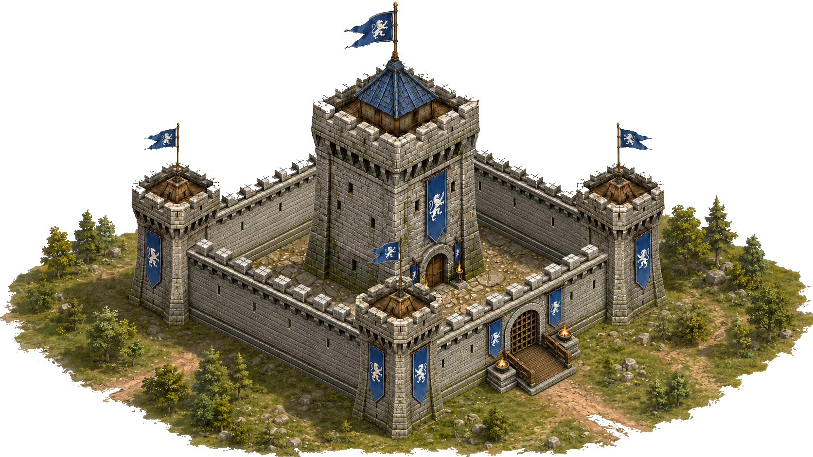

# 🏰 Regional Forts

Regional Forts are strategic alliance objectives that provide permanent bonuses, Honor Marks, and access to the Palace battle.

<figure><figcaption></figcaption></figure>

An alliance may control only **one Fort at a time**.

## Forts and Bonuses

| Fort                | Alliance Bonus              | World Position |
| ------------------- | --------------------------- | -------------- |
| **Northwatch Fort** | 10% Troop Training Speed    | (500, 750)     |
| **Ironvale Fort**   | 10% Research Speed          | (750, 500)     |
| **Southgate Fort**  | 10% March Speed             | (500, 250)     |
| **Westmark Fort**   | 10% Damage Against Monsters | (250, 500)     |

The bonus remains active for as long as the alliance controls the Fort.

## Fort Status and Ownership

Fort status and Fort ownership are displayed separately.

### Status

* **Locked** - The Fort cannot be attacked.
* **Protected** - The Fort has an owner but cannot currently be attacked.
* **Vulnerable** - The Fort can be attacked by alliances.

### Owner

* **Neutral**
* **Alliance Name**

## Attacking a Fort

A Fort can only be attacked through an **Alliance Rally**.

Requirements:

* The Rally initiator must belong to an alliance.
* One or more players may participate in the Rally.
* The attack is always treated as an alliance attack, even when only one player participates.
* Direct individual attacks are not allowed.
* The Fort must be **Vulnerable**.

These rules apply to both neutral Forts and Forts controlled by another alliance.

Multiple simultaneous Rally attacks are not allowed.

## Initial Capture of a Neutral Fort

A neutral Fort is captured by reducing its Fort HP to zero.

```
1 Troop Power = 1 Fort HP Damage
```

Each alliance has its own independent Fort HP progress.

Damage dealt by one alliance:

* Persists between Rally attacks.
* Does not contribute to another alliance's progress.
* Is tracked separately for that alliance.

The first alliance to reduce its own remaining Fort HP value to zero becomes the owner.

### Fort HP Regeneration

Fort HP regenerates permanently at the following rate:

```
1% of Maximum Fort HP every 216 seconds
```

Regeneration continues regardless of:

* Recent damage.
* An active Rally.
* The Fort's current status.
* The progress of other alliances.

Each alliance's Fort HP progress regenerates independently.

## Fort Defense After the Initial Capture

Fort HP is used only for the first capture of a neutral Fort.

After the Fort has been captured for the first time:

* Fort HP is no longer used.
* The Fort is defended exclusively by stationed troops.
* Future attacks use the normal troop combat system.

A defended Fort battle is fought between:

```
Attacking Rally Troops
vs.
Defending Garrison Troops
```

The Fort is captured immediately when the attackers win and at least one attacking troop survives.

## Garrison

After a successful capture, all surviving and wounded troops from the winning Rally remain stationed in the Fort.

This includes troops belonging to every Rally participant.

### Garrison Capacity

```
Maximum Garrison Capacity: 1,000,000 troops
```

Both healthy and wounded troops count toward this limit.

### Reinforce

Members of the owner alliance may send troops individually through **Reinforce**.

Reinforcements participate in the defense only if they arrive before the attacking Rally reaches the Fort.

Reinforcements that arrive after the Rally do not join a battle already in progress.

### Withdrawing Troops

Each player may withdraw only their own stationed troops.

Players cannot withdraw troops belonging to another alliance member.

### Empty Garrison

A Fort with no stationed troops remains owned by its current alliance.

However, during a vulnerability window, it can be captured instantly by any valid Alliance Rally.

Fort HP is not restored or reused.

## Vulnerability Windows

There are **two vulnerability windows per day**.

During a vulnerability window:

* Forts become **Vulnerable**.
* Eligible alliances may initiate Rally attacks.
* Ownership may change multiple times.
* The alliance controlling the Fort at the end of the window is considered the final owner.

Outside these windows, owned Forts are **Protected**.

Temporary ownership changes during a vulnerability window do not affect Holding Reward continuity if the original alliance controls the Fort again when the window ends.

If another alliance controls the Fort at the end of the window:

* The previous alliance loses ownership.
* Its Holding Reward timer is removed.
* A new timer begins for the new owner.

## Rewards

### Capture Reward

At the end of each vulnerability window, every member of the alliance controlling the Fort automatically receives:

```
2,000 Honor Marks
```

Eligibility is checked at the end of the window.

The reward:

* Is granted automatically.
* Does not require battle participation.
* Does not count toward the daily Honor Marks earning limit.
* Cannot exceed the account capacity.
* Burns any amount that cannot be granted.

### Holding Reward

Every member of the owner alliance may claim:

```
2,000 Honor Marks
```

for every completed 24-hour ownership period.

The first Holding Reward becomes available 24 hours after the Fort is captured.

Rules:

* The reward must be claimed manually.
* An alliance may own only one Fort.
* Temporary loss during a vulnerability window does not interrupt the timer if the same alliance controls the Fort at the end of the window.
* Losing the Fort at the end of the window removes the previous timer.
* A new timer starts for the new owner.
* The reward does not count toward the daily Honor Marks earning limit.
* Any amount exceeding the account capacity is burned.

### Battle Reward

After every Fort battle, each participant receives a mail containing:

* The battle report.
* The battle result.
* Total battle damage.
* The participant's contributed Power.
* Honor Marks earned.

Both attackers and defenders are eligible.

#### Total Damage Value

Battle damage is calculated from the Gold value of all troops wounded or killed during the battle, regardless of which side they belonged to.

A troop's Gold value is based on its instant production cost.

```
Total Gold Damage =
Gold Value of All Wounded Troops
+
Gold Value of All Killed Troops
```

#### Global Reward Pool

```
1 Gold of Damage = 1 Honor Mark
```

Therefore:

```
Global Honor Marks Pool = Total Gold Damage
```

#### Reward Distribution

The global reward pool is distributed among all attackers and defenders according to the Power of the troops they contributed to the battle.

```
Participant Share =
Participant Battle Power / Total Battle Power
```

```
Participant Reward =
Global Honor Marks Pool × Participant Share
```

Battle Rewards count toward the daily Honor Marks earning limit.

## Honor Marks Limits

Honor Marks are used in the **Alliance Honor Shop**.

```
Daily Earning Limit: 30,000 Honor Marks
Maximum Account Capacity: 500,000 Honor Marks
```

The following rewards do not count toward the daily earning limit:

* Capture Rewards.
* Holding Rewards.

Battle Rewards and other standard sources count toward the limit.

Neither the daily limit nor the account capacity can be exceeded. Any surplus is permanently burned.

## Palace Access

An alliance must control a Fort to attack the Palace during the Palace vulnerability period.

The Fort may have been:

* Captured while neutral.
* Captured from another alliance.

Fort ownership is verified twice.

### Rally Initiation

```
Alliance owns a Fort: Palace Rally allowed
Alliance owns no Fort: Palace Rally blocked
```

### Rally Arrival

```
Alliance still owns a Fort: Palace battle begins
Alliance owns no Fort: Rally returns home
```

If the alliance loses its Fort while the Rally is marching toward the Palace, the Rally cannot attack and all troops return home.

This makes Regional Forts active strategic objectives throughout the battle for the throne.
